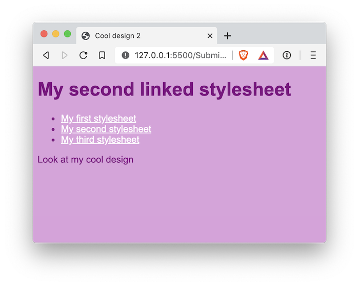
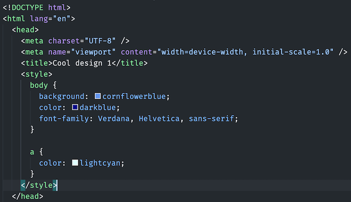
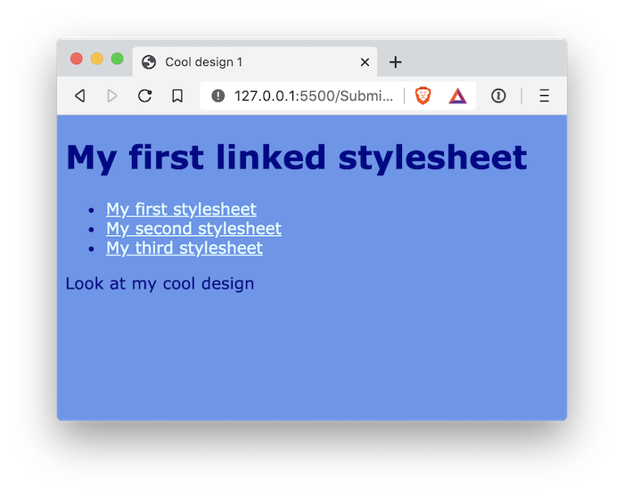
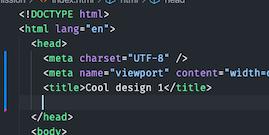
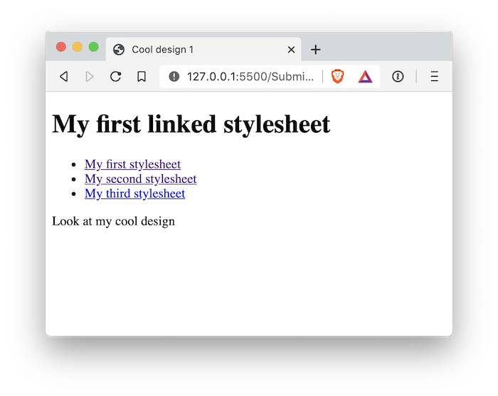
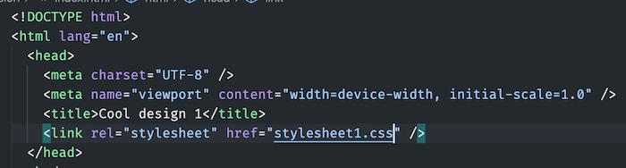

# 01 Exercise - Link CSS files to an HTML page

Add CSS stylesheets to an HTML page using the `<link>` tag

---

## Brief

Share a single CSS stylesheet with multiple HTML pages by using the `<link>` element



---

## Rationale

Having your CSS in a separate `.css` file allows it to be used across multiple HTML pages. To implement this, Web Developers need to know how to link stylesheets to HTML files, so they can apply their design

---

## Getting Started

1. `clone` the exercise repository to your local computer using VS Code or the Terminal.
2. The code for this exercise should go into the `/Submission` folder.

---

## Instructions Part A - Change some styles

1. Open `Submission/index.html` in VS Code
2. In VS Code, look at `Submission/index.html`. In the `<head>` element, you can see a `<style></style>` element that contains some CSS. The CSS that is here changes some of the colours on the web page.
3. In your browser, open the exercise using Live Server. Notice the background and text colours match what is in the `<style>` in your HTML file.
4. Still in your browser, click on the link _My second stylesheet_
5. You should see the same plum background and text styles. If you open `Submission/index2.html`, you can see the same `<style></style>` element, containing the same CSS rules.
6. Now pretend your client has come to you for a website branding update. They want the web page background to be `cornflowerblue` and the text colour to be `darkblue`.
7. In VS Code, open `Submission/index.html`, and find the `<style>` element in the `<head>` element.
8. Delete the existing `<style>` element, from the opening `<style>` tag to the closing `</style>` tag, and the CSS rules in between.
9. Copy and paste the following `<style>` element:

   ```html
   <style>
     body {
       background: cornflowerblue;
       color: darkblue;
       font-family: Verdana, Helvetica, sans-serif;
     }

     a {
       color: lightcyan;
     }
   </style>
   ```

10. Your HTML `<head>` element should look like the following:

    

11. In your web browser, Click _My First Stylesheet_ to go back to the homepage. You should see the background colour has changed to `cornflowerblue` and the text is `darkblue`
12. We want the style to be changed across our entire website, so repeat the above changes to the `<style>` element for `Submission/index2.html`. Both pages should now have the same design.
13. Commit your changes to git



## Instructions Part B - Use a shared CSS file

As you can imagine, when a website gets quite large, making changes in each HTML file every time there is a design change gets quite tricky. You need to remember to update your CSS everywhere, which can be error-prone and laborious. To solve this issue, a CSS file can be shared and linked from an HTML page, meaning we only need to have one CSS file used by multiple HTML pages.

1. Open `Submission/index.html` in VS Code
2. Find the `<style></style>` element inside the `<head></head>` element. We want to move the CSS that is inside this element into it's own file. Select the CSS rules inside the `<style>` element, and copy it to your clipboard (`cmd-c`). Don't copy the `<style></style>` tags, as this is HTML and not CSS.
3. Create a new file in your `Submission` folder, named `stylesheet1.css`
4. Paste the CSS from your clipboard into this new file (`cmd-v`). `stylesheet1.css` should look like the following:

   ```css
   body {
     background: cornflowerblue;
     color: darkblue;
     font-family: Verdana, Helvetica, sans-serif;
   }

   a {
     color: lightcyan;
   }
   ```

5. Now we have a CSS file that contains the same CSS as in the `<style></style>` element from the HTML document.
6. Go back into `Submission/index.html`, and delete the entire `<style></style>` element, including the CSS rules. Your `<head>` element should look like this:

   

7. In your browser, you should notice your page has no design anymore:

   

8. In VS Code, in your `<head></head>` element in your HTML page, where the `<style></style>` used to be, we will use the [`<link>` tag][1] to link `stylesheet1.css` to the page.
9. Add a `link` element, that has a `href` attribute, with the value `stylesheet1.css`. It should look like this: `<link rel="stylesheet" href="stylesheet1.css" />`

   

10. Check your page in the browser, the design should be back!
11. Open `Submission/index2.html`. Remove the `<style></style>` tag, and replace it with `<link rel="stylesheet" href="stylesheet1.css" />`, as in the previous step.
12. Check that it worked by opening your browser and seeing the design for both pages.
13. Commit your changes to git

Your page should look the same as Part A, but now we only have the CSS rules defined once and shared across multiple pages


## Instructions Part C - Change the design

1.  Open `Submission/stylesheet1.css`
2.  In the CSS file, there is a rule that is targeting the `<body>` element.
3.  Change the colours to something you like. You can reference [Colour Values](https://developer.mozilla.org/en-US/docs/Web/CSS/color_value) to help you pick. For example, change the words `cornflowerblue` and `darkblue`, to colours you chose from the colour value reference:

    ```css
    body {
      background: cornflowerblue;
      color: darkblue;
      font-family: Verdana, Helvetica, sans-serif;
    }
    ```

4.  Open your web page using the Live Server, and check your design.

---

# Submit your Exercise

- [ ] Push your code to GitHub by typing `git push`
- [ ] "Mark as done" in Google Classroom

</details>

[1]: [https://www.w3schools.com/Tags/tag_link.asp] "W3C Link tag"

# Walkthrough Solution Video

- Please attempt the exercise first prior to watching the following solution video(s)
- [Loom](https://www.loom.com/share/5d399877ddaf45178c3e1421ed675126?sharedAppSource=personal_library)
